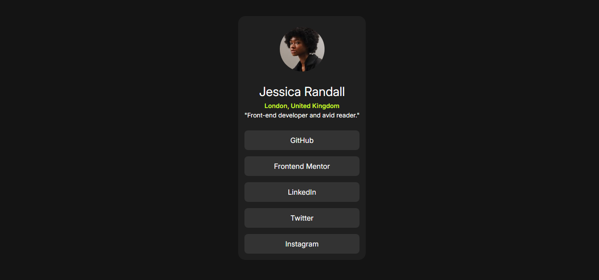

# Frontend Mentor - Social links profile solution

This is a solution to the [Social links profile challenge on Frontend Mentor](https://www.frontendmentor.io/challenges/social-links-profile-UG32l9m6dQ). Frontend Mentor challenges help you improve your coding skills by building realistic projects. 

## Table of contents

- [Overview](#overview)
  - [The challenge](#the-challenge)
  - [Screenshot](#screenshot)
  - [Links](#links)
- [My process](#my-process)
  - [Built with](#built-with)
  - [What I learned](#what-i-learned)
- [Author](#author)

## Overview

### The challenge

Users should be able to:

- See hover and focus states for all interactive elements on the page

### Screenshot

### Links

- Solution URL: [Repository](https://github.com/v-t-9/FrontEndMentorSocialLinksProfile)
- Live Site URL: [Site](https://v-t-9.github.io/FrontEndMentorSocialLinksProfile/)

## My process

### Built with

-Tailwind CSS (https://tailwindcss.com/)

### What I learned

Tailwindcss

## Author

- Frontend Mentor - (https://www.frontendmentor.io/profile/v-t-9)
- Twitter - (https://twitter.com/v_t_9)
- Instagram - (www.instagram.com/v__t__9/)

